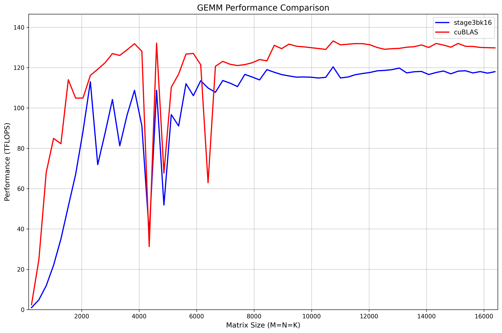

# GEMM-FP16

HGEMM for Ampere Architecture and above (sm>=80). Comes with Torch bindings. Main optimizations: 

- `cp.async` primitives and multi-stage pipelining 
- using tensor cores (wmma API, m16n16k16) 
- block swizzling for L2 cache locality

Performance is competitive with cuBLAS across a wide range of matrix sizes (benchmark run on NVIDIA RTX A6000):

For small matrix sizes, cuBLAS dominates. For medium sizes, this kernel can out perform cuBLAS at certain sizes. At large sizes, both stabilize around 120 TFLOPS, with this kernel achieving over 90% of cuBLAS throughput.

## Compilation

For the benchmark, run `make full`, which will compile the kernels with the benchmark, run those benchmarks and plot the results. For different architectures, you need to change the flags passed into `nvcc`.

For building those kernels as Torch extensions, run `setup.py` with `build_ext` and `--inplace`.

## Note

Although I have already padded smem by 8 bytes, bank conflicts (especially for loading `s_B` into `frag_B` ) are still significant. XOR swizzling is not possible with wmma APIs (which only supports layout hints like `wmma::row_major`). This could be optimized by calling `mma` instructions directly.

With 3 stages, `cache-global` performs better than `cache-all` because we are trading L1 cache for more SRAM.  